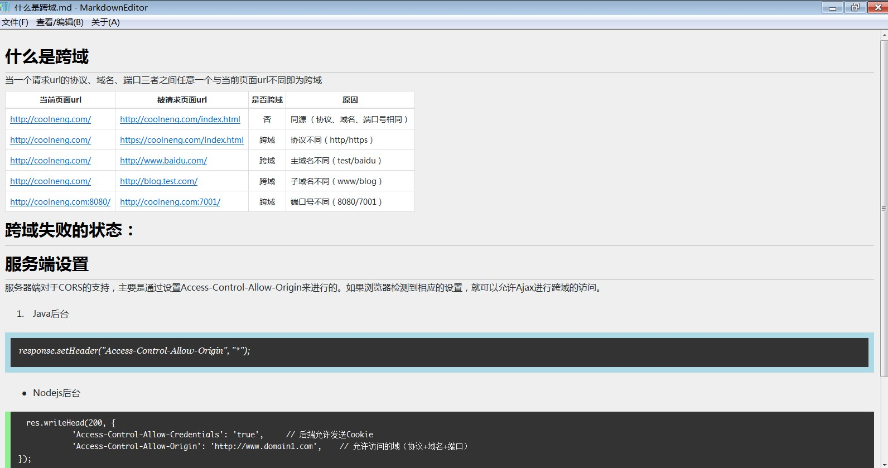
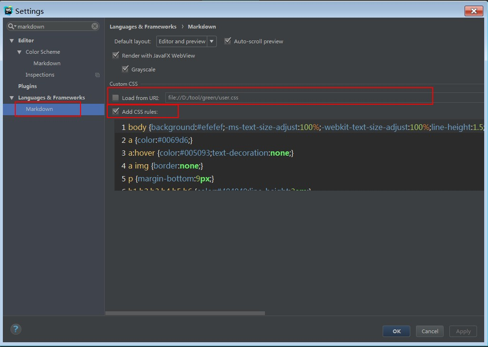
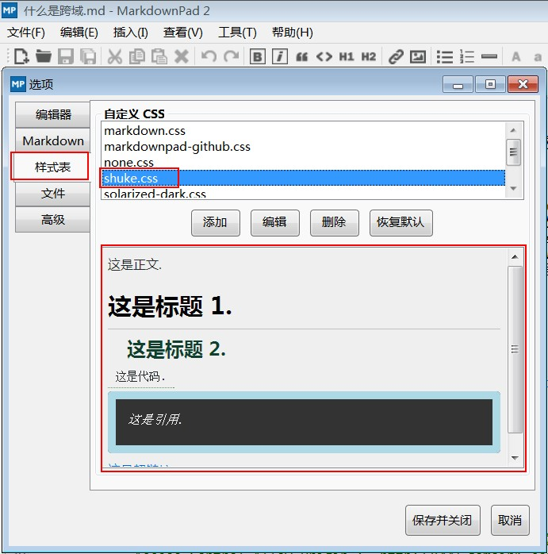
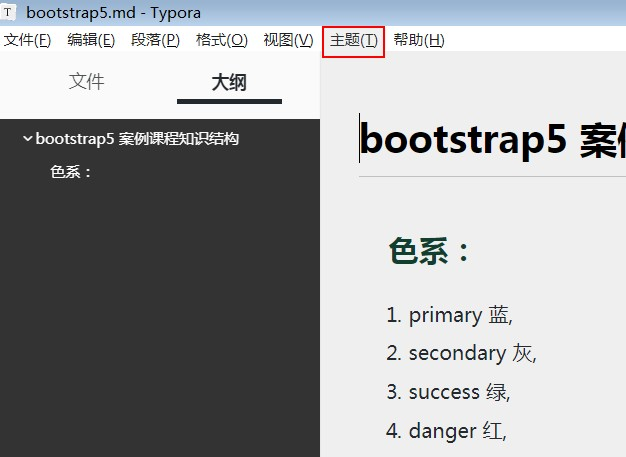

# markdown-ui 
- 文件地址：dist/user.css
- 针对MD的CSS样式，及生成HTML文件大纲做出优化与更改。

##  MarkdownEditor.exe 加载
1. 放到EXE文件同目录下
- 名称为 user.css
- 效果如下：

## webstorm 加载

## MarkdownPad2 加载

## Typora 加载

 

 
# 个人上线项目案例
1. 个人站点 http://www.coolneng.com/
- 微信小程序 “迈向前端”
- 微信公众号 “迈向前端工程师”
	
- 腾讯公开课讲师 https://ke.qq.com/teacher/2028987066?tuin=78efe2ba
- 腾讯云社区专栏 https://cloud.tencent.com/developer/user/5998140

--------------------------
powered by shuke  2020/8/22